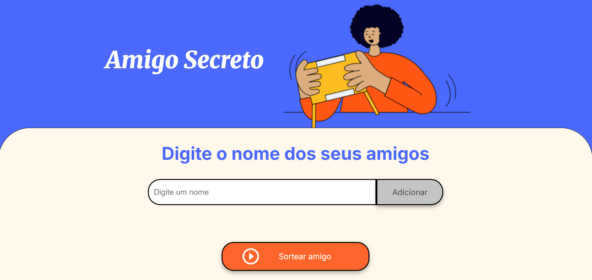

# 🎁 Amigo Secreto

Este é um pequeno jogo interativo de sorteio de **Amigo Secreto**, desenvolvido como parte de um desafio de programação em **JavaScript**. Ele permite adicionar nomes de participantes e realizar um sorteio aleatório.

---

## 🚀 Funcionalidades

✅ Adicionar nomes à lista de participantes.  
✅ Impede nomes duplicados.  
✅ Não permite nomes vazios.  
✅ Sorteia um nome aleatório entre os participantes.  
✅ Exibe mensagens de erro caso não haja nomes suficientes para o sorteio.  
✅ Interface amigável e responsiva.

🖼️ **Captura de Tela:**  

---

## 🛠️ **Tecnologias Utilizadas**
- **HTML** → Estrutura do jogo.  
- **CSS** → Estilização e layout responsivo.  
- **JavaScript (ES6+)** → Lógica do sorteio e manipulação do DOM.  

---
